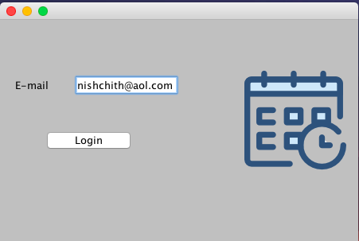
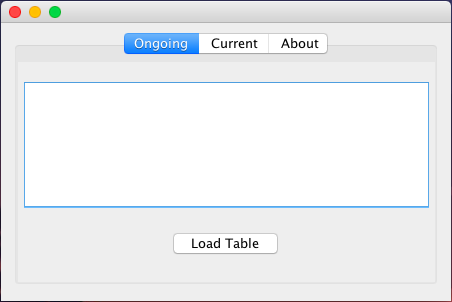

# mini-project
>  Scehduler or notepad :?

### Usage

Add the [dependencies](./dependencies) to your class path .

Try executing Main.java .

Open for issues  [here](https://github.com/inishchith/mini-project/issues)

### Preview

 

### Note

> Part of Academics
