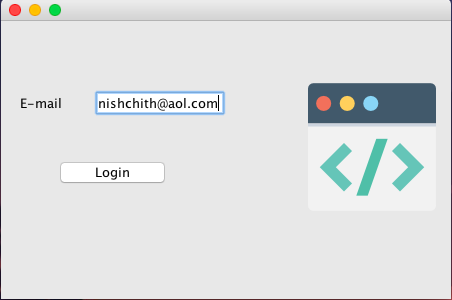
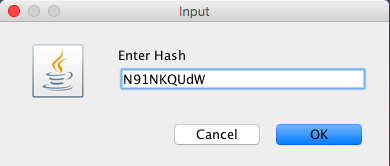
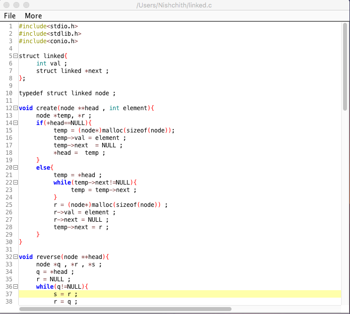

# Sharable NotePad

### Usage

Add the [dependencies](./dependencies) to your class path .

Try executing Main.java .

Open for issues  [here](https://github.com/inishchith/mini-project/issues)

### Installation 

>	[SDKMan](http://sdkman.io/)

>	[Gradle](https://gradle.org/install/)

### Preview

### Note

> Part of Academics
